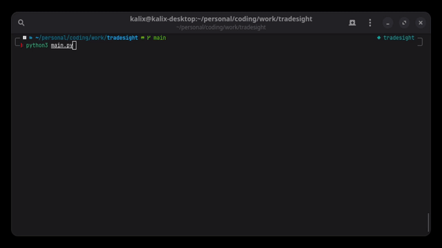

<div align="center">
    <h3 align="center" style="font-size: 35px">Tradesight</h3>
    <p>Converts Trade Republic PDFs to CSV/XLSX/JSON</p>
    <p align="center">
        <a href="README.md">🇬🇧 English version</a>
        &nbsp;•&nbsp;
        <a href="README.it.md">🇮🇹 Italian version</a>
        <br />
        <a href="https://github.com/kalix127/tradesight/issues/new" target="_blank">🐞 Report a Bug</a>
        &nbsp;•&nbsp;
        <a href="https://github.com/kalix127/tradesight/issues/new" target="_blank">✨ Request a Feature</a>
    </p>
    
</div>

> Converts Trade Republic statements to CSV using an Ollama vision model. Built for Trade Republic PDFs; other layouts may work but are unsupported/untested.

## 📚 Table of Contents

- [🚀 Overview](#-overview)
- [⚠️ Disclaimers](#️-disclaimers)
- [🧰 Requirements](#-requirements)
- [🛠️ Installation](#️-installation)
- [⚙️ Configuration](#-configuration)
- [▶️ Usage](#️-usage)
- [🤖 Recommended Models](#-recommended-models)
- [📤 Output](#-output)
- [✅ Testing](#-testing)
- [🛠️ Troubleshooting](#-troubleshooting)
- [📌 Notes & Limitations](#-notes--limitations)
- [📄 License](#-license)

## 🚀 Overview

- Vision-first pipeline: renders each PDF page to an image, enhances it, and asks an Ollama vision model to return table rows.
- Language-flexible: keeps the headers/values exactly as they appear in the PDF (no translations); works across Trade Republic locales.
- Summary-aware: skips account overviews, rollups, and liquidity/market-value summaries; focuses on the transaction tables.
- Single file per PDF (CSV, XLSX, or JSON): `<pdf_name>.<ext>` with all rows in the original column order (headers normalized to lowercase).

## ⚠️ Disclaimers

- Built and tested **only on Trade Republic statements**. Other banks may partly work if you adapt the prompts; no guarantees.
- Personal utility: no warranties; use at your own risk.

## 🧰 Requirements

- Use Python 3.10+
- Run Ollama locally and pull a compatible vision model.
- Poppler tools (needed by `pdf2image`).

## 🛠️ Installation (Unix)

```bash
git clone https://github.com/kalix127/tradesight.git
cd tradesight
python3 -m venv venv
source venv/bin/activate
pip install -r requirements.txt
```

Run setup to choose/pull a model and create `settings.json` (optional but recommended):
```bash
python3 setup.py
```

Ensure Ollama is running:
```bash
ollama serve
```

## ▶️ Usage

### Basic run (default)
```bash
python3 main.py
```
- Reads all PDFs in `input_dir`.
- Writes `<filename>.<ext>` to `output_dir`.

### Debug mode
```bash
python3 main.py --debug
```
- Prints raw model responses and column info; slower but useful for tuning.

### Start from a specific page (debug only)
```bash
python3 main.py --debug --page 3
```
- Skips pages before the given (1-indexed) page; handy when focusing on a problem page without reprocessing the whole PDF.

## ⚙️ Configuration

All config lives in `settings.json`. Keys:

| Key | Type | Default | Notes |
| --- | --- | --- | --- |
| `input_dir` | string | `input` | Folder for PDFs. |
| `output_dir` | string | `output` | Folder for outputs. |
| `output_format` | string | `csv` | `csv` (default), `xlsx`, or `json`; configurable via setup. |
| `max_response_chars` | int | `8000` | Truncate/retry if the model response exceeds this many characters. |
| `max_tokens` | int | `8000` | Upper bound passed to Ollama (`num_predict`) to limit generation length. |
| `save_page_images` | bool | `true` | When true, saves rendered page PNGs to `<pdf>_images/` for debugging. |
| `image.dpi` | int | `300` | Render DPI (higher = sharper, slower). |
| `image.brightness` | float | `1.5` | Image brightening factor. |
| `image.contrast` | float | `1.5` | Image contrast factor. |
| `image.scale` | float | `0.5` | Post-render upscaling for small numerals. |
| `parser.model` | string | `ministral-3:8b` | Ollama model name. |
| `parser.ollama_url` | string | `http://localhost:11434` | Ollama endpoint. |
| `parser.temperature` | float | `0.01` | LLM randomness (lower = more deterministic). |
| `prompts/system_prompt.txt` | file | editable | User-facing prompt; can tweak wording for new layouts/languages. |

You can override the model/URL at runtime: `python3 main.py --model <name> --ollama-url <url>`.

## 🤖 Recommended Models

- **Strongly recommended:** `ministral-3:8b` — highest accuracy for Trade Republic PDFs; expect ~6GB vRAM (or ample system RAM with swap, slower). Use this to avoid messy/incorrect outputs.
- **Lower-accuracy fallback:** `qwen2.5vl:3b` — lighter (~4.2GB vRAM) but may miss small amounts/fields; expect reduced quality.

## 📤 Output

- One file per PDF in the chosen format only (`.csv`, `.xlsx`, or `.json` array of rows).
- Headers are normalized to lowercase but keep the PDF order; case-duplicate headers are collapsed.
- Rows exclude summary/overview/liquidity/portfolio tables; only transaction tables remain.

## ✅ Testing

- OS coverage
  | OS | Status | Notes |
  | --- | --- | --- |
  | Linux | Supported / tested | Primary development platform |
  | macOS (Apple Silicon) | Not yet tested | Planned |
  | Windows | Not yet tested | Planned |

- Model coverage by OS
  | Model \| OS | Linux | macOS (Apple Silicon) | Windows |
  | --- | --- | --- | --- |
  | ministral-3:8b | ✅  | Planned | Planned |
  | qwen2.5vl:3b | ⚠️ Works but noticeably inaccurate | Planned | Planned |

## 🛠️ Troubleshooting

- **Missing small amounts:** Increase `image.dpi` (e.g., 550–600) and `image.scale` (e.g., 1.6–1.8); keep contrast ≥1.3. Use a stronger model if available.
- **Wrong/extra columns:** Ensure `system_prompt.txt` wasn’t edited incorrectly; headers are kept in PDF order and lowercased.
- **Summary rows showing up:** Verify the PDF matches Trade Republic layout; liquidity/portfolio/overview blocks should be skipped by prompt and code. If a new layout appears, update `system_prompt.txt` accordingly.
- **Ollama not responding:** Confirm `ollama serve` is running and the model is pulled.

## 📄 License

[MIT](./LICENSE)
